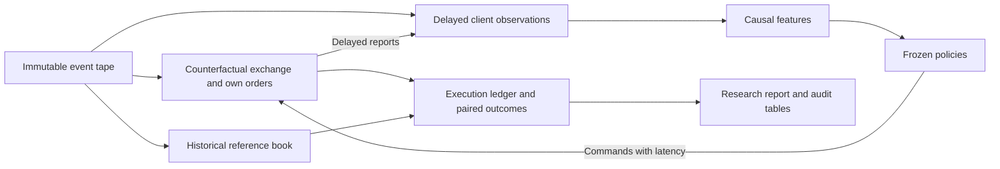

# QExec

**Queue-aware execution under latency and adverse selection — a research replay engine
(synthetic-data build).**

QExec studies, on an event-driven replay engine, whether a *queue-aware* order-execution policy
reduces implementation-shortfall cost without worsening deadline-completion risk, under explicit
latency and a frozen decision protocol. It compares baseline and model-based policies on paired
counterfactual "worlds" built from a single immutable market-data tape.

## Current release

The Python core is a local command-line research tool. It generates synthetic order-book data,
reconstructs price-time priority, simulates delayed orders and reports, fits models using
chronological splits, and evaluates frozen policies on paired execution tasks. Outputs include
a Markdown research report, Parquet audit tables, model artifacts, and replayable order traces.

Browse the [example research report](examples/synthetic-demo/report.md) and its
[saved configuration](examples/synthetic-demo/config.json) without installing anything.
The example uses four synthetic sessions and two latency scenarios. It explicitly reports
that both B3 variants used fallback decisions at all 21 eligible primary checkpoints: the zero
paired effect does **not** establish a queue-model advantage. One test session is insufficient
for an informative session-level interval. This small demo validates the software workflow.

| Policy | Execution decision |
|---|---|
| B0 | Cross immediately. |
| B1 | Join the best price, then use the terminal controller before the deadline. |
| B2 | Use a price-direction forecast aligned to the remaining decision horizon. |
| B3 | Choose HOLD or SWITCH using estimated cost and a frozen completion-risk allowance. |
| B3_NO_QUEUE | Apply the same B3 rule without own-order queue features. |

The comparison asks whether queue features change useful decisions after holding the price
signal, task population, timing, and execution assumptions fixed. The original planning
documents describe a larger market study; this release completes the synthetic Python scope.
Vendor ingestion, licensed-market validation, optional C++, and P1 optimal stopping remain
future work. See [limitations](docs/limitations.md) and the
[review and validation record](docs/remediation.md).



> **Zero cost, synthetic data only.** This build spends **no money**: no market-data
> subscription, no API keys, no cloud, no CI minutes, and **no network access anywhere** in the
> code or tests. All data is **synthetic**, generated locally by `qexec.synthetic`. Results are
> **software validation of the pipeline, never a market finding** — they make no claim about any
> real instrument, venue, or strategy, and no claim of profitability or novelty. The real-data
> gate (G0) and the final real-data holdout are **BLOCKED pending a licensed, paid data
> subscription and a vendor adapter**. No real-data adapter is implemented; a real-data study
> requires additional ingestion and validation work.

## Install (uv)

QExec uses [uv](https://docs.astral.sh/uv/) for a locked, reproducible environment.

```powershell
# From the repository root (Windows / PowerShell). If uv is not on PATH after install:
#   $env:Path = [Environment]::GetEnvironmentVariable('Path','User') + ';' + $env:Path
uv sync --locked
```

Python 3.12 is required (see `.python-version` / `pyproject.toml`). Runtime dependencies are
numpy, polars, pyarrow, and scikit-learn, all pinned in `uv.lock`.
The first install may download these free dependencies. After the cache is populated,
`uv sync --locked --offline` and `uv run --locked --offline ...` prohibit downloads.

## Quickstart

```powershell
# 1. End-to-end synthetic demo: study + Markdown research report (the CI smoke command).
uv run --locked qexec demo --out out\demo --sessions 4 --quick

# 2. Generate synthetic sessions on their own.
uv run --locked qexec synth --out out\sessions --sessions 4 --duration 120 --seed 0

# 3. Validate a session (checksums + ReferenceBook replay; nonzero exit on anomalies).
uv run --locked qexec replay validate --session out\sessions\SYN-0001

# 4. Build the policy-independent task manifest for a session.
uv run --locked qexec tasks build --session out\sessions\SYN-0001 --horizon-ms 1000

# 5. Run the full research study, then render its report.
uv run --locked qexec experiment run --out out\study --quick
uv run --locked qexec analysis report --study out\study

# 6. Print the causal trace of one (task, policy) world.
uv run --locked qexec trace task --session out\sessions\SYN-0001 --task-id SYN-0001:00000:BUY --policy B1
```

Every command prints that the data is SYNTHETIC. Exit codes: `0` success, `2` usage error,
`1` runtime failure. See `docs/quickstart.md` for a guided walkthrough.

The demo writes `out/demo/report/report.md`. Open that file to read the results; this release
has no graphical application or dashboard. Generated runs stay local and are excluded from Git.
The checked-in example is an explicitly sanitized report, not a complete sealed study bundle.

Every study or demo needs a new or empty `--out` directory, including retries with the same
configuration. Existing runs are never replaced. Reports require an intact `COMPLETE` status
and verify the saved configuration, freeze, and results against the completion hashes. Study
traces also verify the frozen dataset and append every replay to `freeze/unblinding.log`.

## Pipeline, hooks, and the merge gate

The code and tests run locally without network access. After dependencies are cached,
`scripts/ci.ps1 -Offline` also prohibits dependency downloads. The script stops at the
first failure, printing `PIPELINE PASSED` on success:

```powershell
powershell -NoProfile -ExecutionPolicy Bypass -File scripts\ci.ps1 -Offline
```

| Stage | What it checks |
|---|---|
| `lock` / `sync` | `uv.lock` matches `pyproject.toml`; environment installs from the lock. |
| `format` | `ruff format --check` on `python` and `tests`. |
| `lint` | `ruff check`. |
| `types` | `mypy --strict`. |
| `tests` | `pytest` (synthetic fixtures only; no network, no credentials). |
| `smoke` | FULL mode only: `qexec demo --out <tmp> --sessions 2 --quick` end to end. |

- **Pre-commit hook** (`scripts/hooks/pre-commit`, installed by `scripts/install-hooks.ps1`) runs
  the pipeline in **fast mode** (`-Fast`: excludes `@slow` tests and the smoke stage). Never
  bypass it with `--no-verify`.
- **Merge gate** (`scripts/merge-gate.ps1 -Branch <branch>`) runs the FULL pipeline inside the
  feature worktree, merges with `--no-ff`, then re-runs the FULL pipeline on the merged result.

## Repository map

```text
python/qexec/
  core/        frozen types, config (latency scenarios, horizons), task contracts, session I/O
  synthetic/   local synthetic MBO generator (the only data source in this build)
  adapters/    batch assembly + record diagnostics
  reference/   authoritative ReferenceBook (price-time priority)
  sim/         replay engine: overlay, OMS, controller, scheduler, SessionEngine, task manifest
  features/    causal market features, observable queue-cohort proxy, feature allowlists
  labels/      price-direction labels from committed mids
  models/      price model, action (miss/cost) models, support rule, schema, artifacts
  policies/    baselines (B0/B1) and model policies (B2, B3, B3_NO_QUEUE)
  analysis/    metrics, statistics, support gate, tables, Markdown report
  experiments/ StudyConfig, StudyLayout, the 10-stage run_study pipeline
  cli/         the `qexec` command-line entry point (this work package)
tests/         unit/, integration/, golden/ (synthetic fixtures only)
docs/          engineering contract, specs, and the release docs linked below
scripts/       ci.ps1, merge-gate.ps1, install-hooks.ps1, hooks/
```

## Status of gates

The build gates below are **implemented and tested on synthetic data** (see
[`docs/remediation.md`](docs/remediation.md) for the external-review remediation that hardened
them). "Implemented and tested on synthetic data" is a software-validation statement about the
pipeline — **never** a market finding or a claim about any real instrument, venue, or strategy.

| Gate | Status on this synthetic build |
|---|---|
| G1 book reconstruction | **Implemented and tested on synthetic data** (see docs/remediation.md) — adapters/reference tests. |
| G2 execution/timing/overlay | **Implemented and tested on synthetic data** (see docs/remediation.md) — sim/overlay/engine tests. |
| G2-S horizon support | **Implemented and tested on synthetic data** (see docs/remediation.md) — support gate reads counts only. |
| G4 leakage / causal information | **Implemented and tested on synthetic data** (see docs/remediation.md) — feature/label/probe tests. |
| G5 model validation / allowlists | **Implemented and tested on synthetic data** (see docs/remediation.md) — models/policies tests. |
| G6 paired comparison / denominators | **Implemented and tested on synthetic data** (see docs/remediation.md) — stats/tables/report. |
| G7 reproducible release | **Implemented and tested on synthetic data** (see docs/remediation.md) — CLI + demo smoke + report. |
| G0 real-data feasibility | **BLOCKED pending paid data.** Not run; no real-data adapter is implemented; no real-data claim made. |
| G3 native C++ parity (R11) | **Not built** in this build (optional extension). |
| GA P1 optimal-stopping (R12) | **Not built** in this build (optional extension). |

See `docs/test_traceability.md` for the full test-ID (T01–T60) → test-function map, including the
honestly-marked uncovered IDs.

## Documentation

- `docs/quickstart.md` — guided first run.
- `docs/reproducing.md` — exact reproduction, including the (instructions-only) licensed
  real-data path and its cost-approval requirement.
- `docs/limitations.md` — what the synthetic results do and do not mean.
- `docs/test_traceability.md` — T01–T60 coverage map.
- `docs/engineering_contract.md`, `docs/engine_spec.md`, `docs/research_spec.md` — binding
  interface and research contracts.
